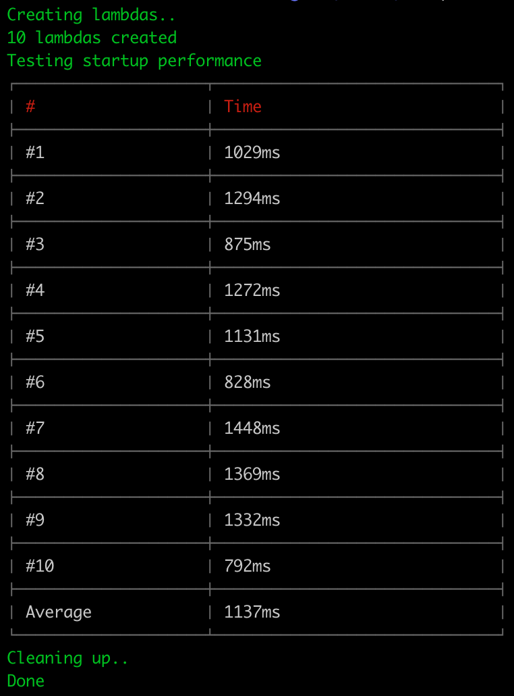

# lambda-coldstart-benchmark

A simple benchmark to test how quickly a lambda function on AWS can start.

AWS Lambda _might_ reuse a container on repeat invocations, this will test how quickly it starts the first time.
As this benchmark specifically tests cold start performance it creates multiple separate lambdas rather than invoking the same one again. This way we get an idea of what a cold start looks like. 

## Results (March 2, 2016):



## Running the benchmark

### Clone the git repo

```
git clone git@github.com:akupila/lambda-coldstart-benchmark.git
cd lambda-coldstart-benchmark
```

### Create AWS.json

- Rename `aws.json.sample` to `aws.json`

### Set up AWS credentials

_If you already have ~/.aws/credentials you can copy the info from there instead_

- Go to [https://console.aws.amazon.com/iam/home#security_credential](AWS IAM security credentials)
- Click `Access Keys`
- Click `Create New Access Key`
- Click `Show Access Key`
- Copy the key and secret into `aws.json`

_It's probably a good idea to download the key file too, you won't be able to retrieve this later!_

### Create a lambda role

_Skip this step if you already have an IAM role for lambda_

- Go to [https://console.aws.amazon.com/iam/home#roles](AWS Identity and Access management)
- Create a new role
- Call the role `lambda-benchmark` (or whatever you want)
- From the `AWS Service Roles` select `AWS Lambda`
- Attach the `AdministratorAccess` policy
- Copy the `Role ARN` into `role` in `config.json`

### Run benchmark

```
npm install
npm start -s
```

`-s` is used to silence NPM output, just nicer to look at

`npm run repeat -s` will do the same thing except run the benchmark twice in a row with the same functions; this _likely_ will be a warm start the second time so it should be faster.

## Cleaning up

Unless something breaks the benchmark will clean up after itself. 
The only thing that remains is the Lambda IAM role in AWS which you can delete in [https://console.aws.amazon.com/iam/home#roles](AWS IAM roles)

In case lambdas for some reason are not cleared up you can delete them manually at [https://console.aws.amazon.com/lambda/home#/functions](AWS Lambda functions). 
If you see a splash screen with a `Get Started Now` button you don't have any lambdas - all good!
